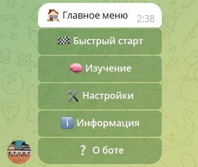
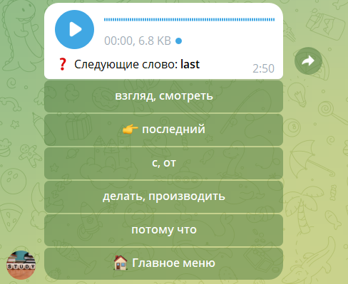

<a href="https://t.me/l_words_bot">L-words:</a> Телеграм-бот для запоминания слов

Английская версия этой статьи

Содержание

# Начало

Всем привет,

В данной статья я хочу вас познакомить с Телеграм-ботом для запомининия инстранных слов. В боте используется интервальный метод запоминания слов, который позволяет запоминать слова в большом количестве с минимальными усилиями. Слова поторяются через определенные интервалы времени и тем самым не успевая забыться до следующего повторения. Интервалы для повторения были выбраны на основе научных исследований. Для изучения используется месенджер Телеграм, который уведомляет обучающегося что пришло время для повторения.

# Погнали учить
Запускаем бота и видит начальное меню

Жмем "Быстрый старт" и погнали учить 150 самых частых слов английского языка

# Как пользоваться
- Мне мало слов в день, хочу больше  
    "Главное меню" -> "Настройки" -> "Количество слов в день" -> Вводим сколько хотим слов в день
- Хочу добавить еще один словарь для изучения  
    "Главное меню" -> "Изучение" -> "Добавить словарь" -> Выбираем словарь
- Плохо запоминаю слова, хочу чтобы они почаще повтоярлись  
    "Главное меню" -> "Настройки" -> "Частота посторений" -> "Часто"

# Режимы работы
- 

# Словари

